# PSoC&trade; 4: CAPSENSE&trade; proximity gestures

This code example demonstrate how to detect swipe gestures in the X-axis and Y-axis using the proximity sensors on [CY8CKIT-024](https://www.infineon.com/CY8CKIT-024) using the PSoC&trade; 4 device.

[View this README on GitHub.](https://github.com/Infineon/mtb-example-psoc4-capsense-proximity-gestures)

[Provide feedback on this code example.](https://cypress.co1.qualtrics.com/jfe/form/SV_1NTns53sK2yiljn?Q_EED=eyJVbmlxdWUgRG9jIElkIjoiQ0UyMzc4OTIiLCJTcGVjIE51bWJlciI6IjAwMi0zNzg5MiIsIkRvYyBUaXRsZSI6IlBTb0MmdHJhZGU7IDQ6IENBUFNFTlNFJnRyYWRlOyBwcm94aW1pdHkgZ2VzdHVyZXMiLCJyaWQiOiJyYWphbm5hZ2F1dGEiLCJEb2MgdmVyc2lvbiI6IjEuMS4wIiwiRG9jIExhbmd1YWdlIjoiRW5nbGlzaCIsIkRvYyBEaXZpc2lvbiI6Ik1DRCIsIkRvYyBCVSI6IklDVyIsIkRvYyBGYW1pbHkiOiJQU09DIn0=)

## Requirements

- [ModusToolbox&trade; software](https://www.infineon.com/modustoolbox) v3.1 or later (tested with v3.1)
- Board support package (BSP) minimum required version: 3.1.0
- Programming language: C
- Associated parts: [PSoC&trade; 4100S Max, and PSoC&trade; 4500S](https://www.infineon.com/cms/en/product/microcontroller/32-bit-psoc-arm-cortex-microcontroller/psoc-4-32-bit-arm-cortex-m0-mcu)


## Supported toolchains (make variable 'TOOLCHAIN')

- GNU Arm&reg; Embedded Compiler v11.3.1 (`GCC_ARM`) - Default value of `TOOLCHAIN`
- Arm&reg; Compiler v6.16 (`ARM`)
- IAR C/C++ Compiler v9.30.1 (`IAR`)

## Supported kits (make variable 'TARGET')

- [PSoC&trade; 4100S Max Pioneer Kit](https://www.infineon.com/CY8CKIT-041S-MAX) (`CY8CKIT-041S-MAX`) - Default target
- [PSoC&trade; 4500S Pioneer Kit](https://www.infineon.com/CY8CKIT-045S) (`CY8CKIT-045S`)

## Hardware setup

The [CY8CKIT-024](https://www.infineon.com/CY8CKIT-024) has Arduino-compatible headers and can be connected to the [CY8CKIT-041S-MAX](https://www.infineon.com/CY8CKIT-041S-MAX) kit. To test the project with [CY8CKIT-041S-MAX](https://www.infineon.com/CY8CKIT-041S-MAX), connect the kit to [CY8CKIT-024](https://www.infineon.com/CY8CKIT-024), as shown in **Figure 1**.

   **Figure 1. Hardware connection**  

   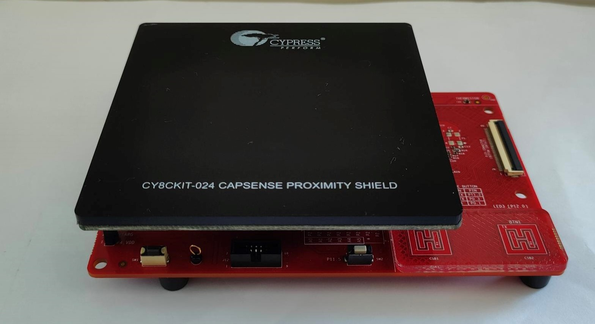
   
1. When the two kits are connected, the J1, J2, J3, and J4 headers on [CY8CKIT-041S-MAX](https://www.infineon.com/CY8CKIT-041S-MAX) connect to the J1, J2, J3, and J4 headers on [CY8CKIT-024](https://www.infineon.com/CY8CKIT-024) respectively.

2. On [CY8CKIT-024](https://www.infineon.com/CY8CKIT-024), slide SW1 to select SHIELD.

> **Note:** Press the reset switch, SW1, on [CY8CKIT-041S-MAX](https://www.infineon.com/CY8CKIT-041S-MAX) whenever you change the slide switch, SW1, position on [CY8CKIT-024](https://www.infineon.com/CY8CKIT-024).

- Follow the same hardware setup steps for [CY8CKIT-045S](https://www.infineon.com/CY8CKIT-045S).

### Board rework on [CY8CKIT-045S](https://www.infineon.com/CY8CKIT-045S)
For [CY8CKIT-045S](https://www.infineon.com/CY8CKIT-045S), pins P2[4] and P2[5] are configured as CYBSP_DEBUG_UART_RX and CYBSP_DEBUG_UART_TX. To use these pins for [CY8CKIT-024](https://www.infineon.com/CY8CKIT-024), remove resistors R27 and R26.

> **Note:** Some of the PSoC&trade; 4 kits ship with KitProg2 installed. The ModusToolbox&trade; software requires KitProg3. Before using this code example, make sure that the board is upgraded to KitProg3. The tool and instructions are available in the [Firmware-loader](https://github.com/Infineon/Firmware-loader) GitHub repository. If you do not upgrade, you will see an error like "unable to find CMSIS-DAP device" or "KitProg firmware is out of date".

## Software setup

This example requires no additional software or tools.

## Using the code example

### Create the project

The ModusToolbox&trade; tools package provides the Project Creator as both a GUI tool and a command line tool.

<details><summary><b>Use Project Creator GUI</b></summary>

1. Open the Project Creator GUI tool.

   There are several ways to do this, including launching it from the dashboard or from inside the Eclipse IDE. For more details, see the [Project Creator user guide](https://www.infineon.com/ModusToolboxProjectCreator) (locally available at *{ModusToolbox&trade; install directory}/tools_{version}/project-creator/docs/project-creator.pdf*).

2. On the **Choose Board Support Package (BSP)** page, select a kit supported by this code example. See [Supported kits](#supported-kits-make-variable-target).
   > **Note:** To use this code example for a kit not listed here, you may need to update the source files. If the kit does not have the required resources, the application may not work.

3. On the **Select Application** page:

   a. Select the **Applications(s) Root Path** and the **Target IDE**.

   > **Note:** Depending on how you open the Project Creator tool, these fields may be pre-selected for you.

   b.	Select this code example from the list by enabling its check box.

   > **Note:** You can narrow the list of displayed examples by typing in the filter box.

   c. (Optional) Change the suggested **New Application Name** and **New BSP Name**.

   d. Click **Create** to complete the application creation process.

</details>

<details><summary><b>Use Project Creator CLI</b></summary>

The 'project-creator-cli' tool can be used to create applications from a CLI terminal or from within batch files or shell scripts. This tool is available in the *{ModusToolbox&trade; install directory}/tools_{version}/project-creator/* directory.

Use a CLI terminal to invoke the 'project-creator-cli' tool. On Windows, use the command-line 'modus-shell' program provided in the ModusToolbox&trade; installation instead of a standard Windows command-line application. This shell provides access to all ModusToolbox&trade; tools. You can access it by typing "modus-shell" in the search box in the Windows menu. In Linux and macOS, you can use any terminal application.

The following example clones the "mtb-example-psoc4-capsense-proximity-gestures" application with the desired name "CapsenseProximityGestures" configured for the CY8CKIT-041S-MAX BSP into the specified working directory, C:/mtb_projects:

   ```
   project-creator-cli --board-id CY8CKIT-041S-MAX --app-id mtb-example-psoc4-capsense-proximity-gestures --user-app-name CapsenseProximityGestures --target-dir "C:/mtb_projects"
   ```

The 'project-creator-cli' tool has the following arguments:

Argument | Description | Required/optional
---------|-------------|-----------
`--board-id` | Defined in the <id> field of the [BSP](https://github.com/Infineon?q=bsp-manifest&type=&language=&sort=) manifest | Required
`--app-id`   | Defined in the <id> field of the [CE](https://github.com/Infineon?q=ce-manifest&type=&language=&sort=) manifest | Required
`--target-dir`| Specify the directory in which the application is to be created if you prefer not to use the default current working directory | Optional
`--user-app-name`| Specify the name of the application if you prefer to have a name other than the example's default name | Optional

> **Note:** The project-creator-cli tool uses the `git clone` and `make getlibs` commands to fetch the repository and import the required libraries. For details, see the "Project creator tools" section of the [ModusToolbox&trade; tools package user guide](https://www.infineon.com/ModusToolboxUserGuide) (locally available at {ModusToolbox&trade; install directory}/docs_{version}/mtb_user_guide.pdf).


</details>

### Open the project

After the project has been created, you can open it in your preferred development environment.

<details><summary><b>Eclipse IDE</b></summary>


If you opened the Project Creator tool from the included Eclipse IDE, the project will open in Eclipse automatically.

For more details, see the [Eclipse IDE for ModusToolbox&trade; user guide](https://www.infineon.com/MTBEclipseIDEUserGuide) (locally available at *{ModusToolbox&trade; install directory}/docs_{version}/mt_ide_user_guide.pdf*).

</details>


<details><summary><b>Visual Studio (VS) Code</b></summary>

Launch VS Code manually, and then open the generated *{project-name}.code-workspace* file located in the project directory.

For more details, see the [Visual Studio Code for ModusToolbox&trade; user guide](https://www.infineon.com/MTBVSCodeUserGuide) (locally available at *{ModusToolbox&trade; install directory}/docs_{version}/mt_vscode_user_guide.pdf*).

</details>


<details><summary><b>Keil µVision</b></summary>

Double-click the generated *{project-name}.cprj* file to launch the Keil µVision IDE.

For more details, see the [Keil µVision for ModusToolbox&trade; user guide](https://www.infineon.com/MTBuVisionUserGuide) (locally available at *{ModusToolbox&trade; install directory}/docs_{version}/mt_uvision_user_guide.pdf*).

</details>

<details><summary><b>IAR Embedded Workbench</b></summary>

Open IAR Embedded Workbench manually, and create a new project. Then select the generated *{project-name}.ipcf* file located in the project directory.

For more details, see the [IAR Embedded Workbench for ModusToolbox&trade; user guide](https://www.infineon.com/MTBIARUserGuide) (locally available at *{ModusToolbox&trade; install directory}/docs_{version}/mt_iar_user_guide.pdf*).

</details>

<details><summary><b>Command line</b></summary>


If you prefer to use the CLI, open the appropriate terminal, and navigate to the project directory. On Windows, use the command-line 'modus-shell' program; on Linux and macOS, you can use any terminal application. From there, you can run various `make` commands.

For more details, see the [ModusToolbox&trade; tools package user guide](https://www.infineon.com/ModusToolboxUserGuide) (locally available at *{ModusToolbox&trade; install directory}/docs_{version}/mtb_user_guide.pdf*).

</details>


## Operation

1. Connect [CY8CKIT-024](https://www.infineon.com/CY8CKIT-024) to [CY8CKIT-041S-MAX](https://www.infineon.com/CY8CKIT-041S-MAX) as explained in the **Hardware setup**.
2. Connect the board to your PC using the provided USB cable through the KitProg3 USB connector.
3. Program the board using one of the following:

   <details><summary><b>Using Eclipse IDE</b></summary>

      1. Select the application project in the Project Explorer.

      2. In the **Quick Panel**, scroll down, and click **\<Application Name> Program (KitProg3_MiniProg4)**.

   </details>

   <details><summary><b>In other IDEs</b></summary>

   Follow the instructions in your preferred IDE.
   </details>


   <details><summary><b>Using CLI</b></summary>

     From the terminal, execute the `make program` command to build and program the application using the default toolchain to the default target. The default toolchain is specified in the application's Makefile but you can override this value manually:
      ```
      make program TOOLCHAIN=<toolchain>
      ```

      Example:
      ```
      make program TOOLCHAIN=GCC_ARM
      ```
   </details>
4. To verify the swipe gestures performed in the X-axis, hover your hand over the kit at a distance of 2 cm and move the hand from left to right, as shown in **Figure 2**, or from right to left. Observe that the LEDs turn on in the sequence listed in **Figure 3**.

   **Figure 2.  Left-to-Right Swipe Gesture**  

   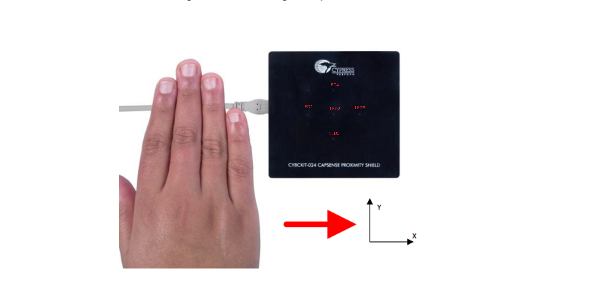
   
   **Figure 3. LED Turn-ON sequence for LED_DRIVE_DURING_GESTURE** 
   
   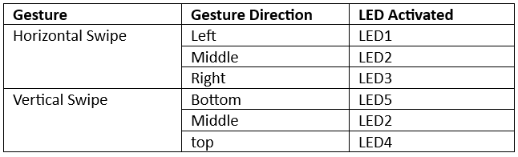
   
5. Similarly, to verify the swipe gestures performed in the Y-axis, set the macro **GESTURE_AXIS** to **YAXIS** in user_gestures.h file and program the device. 
6. Hover your hand over the kit at a distance of 2 cm and move it from top to bottom, as shown in **Figure 4**, or from bottom to top. Observe that the LEDs turn on in the sequence listed in **Figure 3**.

   **Figure 4.  Top-to-Bottom Swipe Gesture**  

   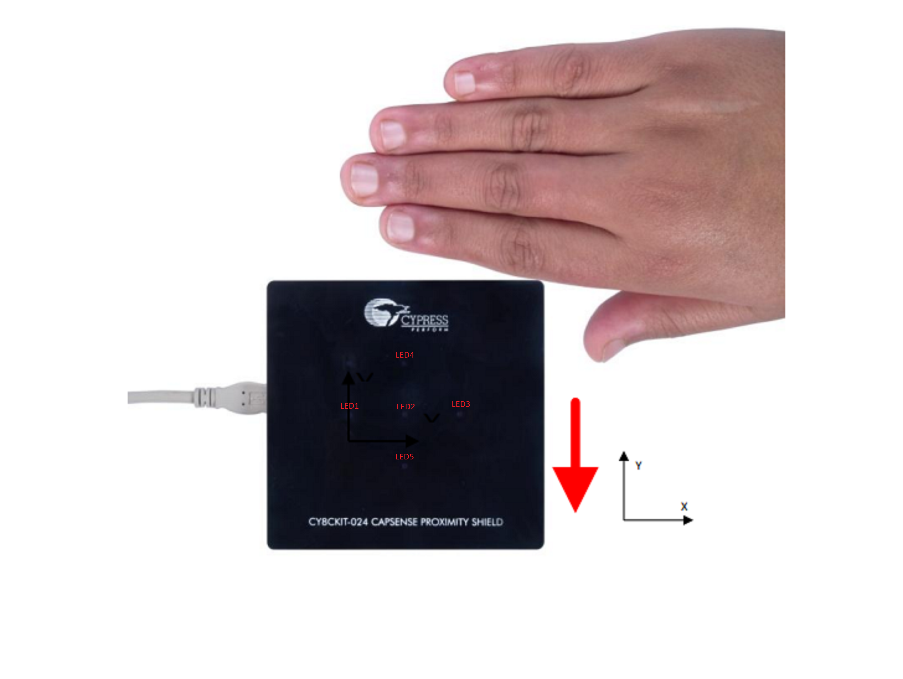
   
7. To drive the LEDs after the gesture is completed, set the macro **LED_DRIVE_SEQUENCE** to **LED_DRIVE_AFTER_GESTURE** in user_gestures.h file and repeat this procedure using **Figure 5** as a guide.

   **Figure 5. LED Turn-ON sequence for LED_DRIVE_AFTER_GESTURE**
   
   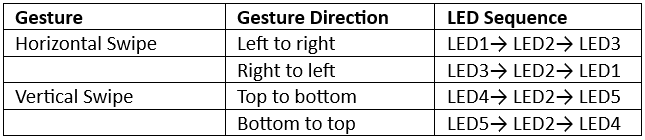

> **Note:** When the macro **LED_DRIVE_SEQUENCE** is set to **LED_DRIVE_AFTER_GESTURE,** the LEDs turn ON only when the gesture is completed, that is, when the hand has completely moved away from the kit.

### Monitor data using CAPSENSE&trade; Tuner

The CAPSENSE&trade; Tuner is a stand-alone tool included with the ModusToolbox&trade; software. The tool is used to 
tune CAPSENSE&trade; applications.

1. Open CAPSENSE&trade; Tuner from the 'BSP Configurators' section in the IDE Quick Panel.

   You can also run the CAPSENSE&trade; Tuner application standalone from *{ModusToolbox&trade; install directory}/ModusToolbox&trade;/tools_{version}/capsense-configurator/capsense-tuner*. In this case, after opening the application, select **File** > **Open** and open the *design.cycapsense* file of the respective application, which is present in the *{Application root directory}/bsps/TARGET_APP_\<BSP-NAME>/COMPONENT_BSP_DESIGN_MODUS/* folder.

   See the [ModusToolbox&trade; user guide](https://www.infineon.com/ModusToolboxUserGuide) (locally available at *{ModusToolbox&trade; install directory}/docs_{version}/mtb_user_guide.pdf*)for options to open the CAPSENSE&trade; tuner application using the CLI.

2. Ensure that the kit is in CMSIS-DAP Bulk mode (KitProg3 Status LED is ON and not blinking). See [Firmware-loader](https://github.com/Infineon/Firmware-loader) to learn how to update the firmware and switch modes in KitProg3.

3. In the tuner application, click on the **Tuner communication setup** icon or select **Tools** > **Tuner communication setup**. In the window that appears, select the I2C checkbox under KitProg3 and configure as follows:

   - **I2C address:** 8
   - **Sub-address:** 2 bytes
   - **Speed (kHz):** 400

   These are the same values set in the EZI2C resource.

   **Figure 6. Tuner communication setup parameters**
   
   

4. Click **Connect** or select **Communication** > **Connect** to establish a connection.

   **Figure 7. Establish connection**

   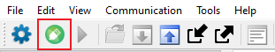

5. Click **Start** or select **Communication** > **Start** to start data streaming from the device.

   **Figure 8. Start tuner communication**

   

   The **Widget/Sensor Parameters** tab is updated with the parameters configured in the CAPSENSE&trade; Configurator window. The tuner displays the data from the sensor in the **Widget View** and **Graph View** tabs.

6. Set the **Read mode** to **Synchronized mode**. Navigate to the **Widget view** tab and notice that the **PS1** widget is highlighted in blue when you hover your hand at a distance of 2 cm above the proximity sensor.

   **Figure 9. Widget view of the CAPSENSE&trade; Tuner**

   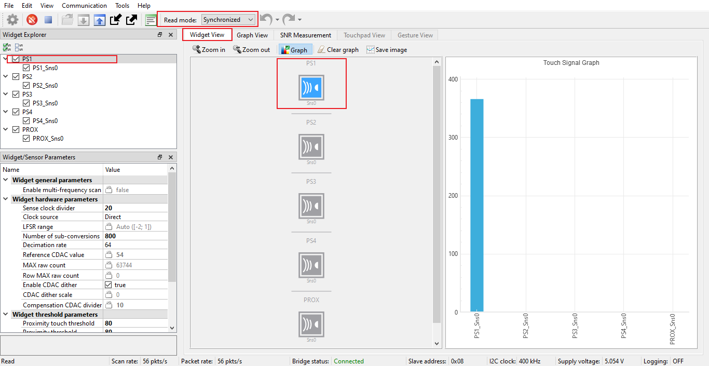
   
7. Go to the **Graph View** tab to view the raw count, baseline, difference count, and status of a proximity sensor.

   **Figure 10. Graph view of the CAPSENSE&trade; Tuner**

   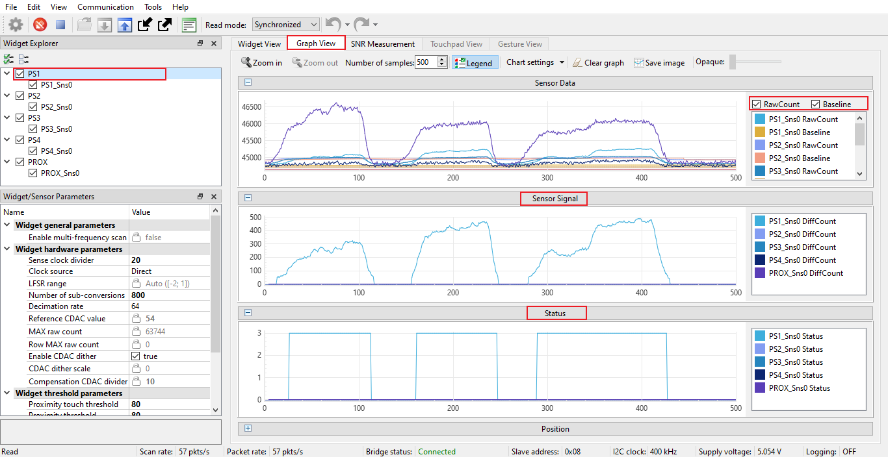

8. Observe the **Widget/Sensor parameters** section in the CAPSENSE&trade; Tuner window as shown in Figure 9.

9. Switch to the SNR Measurement tab for measuring the SNR and to verify that the SNR is above 5:1, select PS1_Sns0 sensor, and then click **Acquire Noise** as shown in **Figure 11**.

    **Figure 11. CAPSENSE&trade; Tuner - SNR Measurement**  
   
    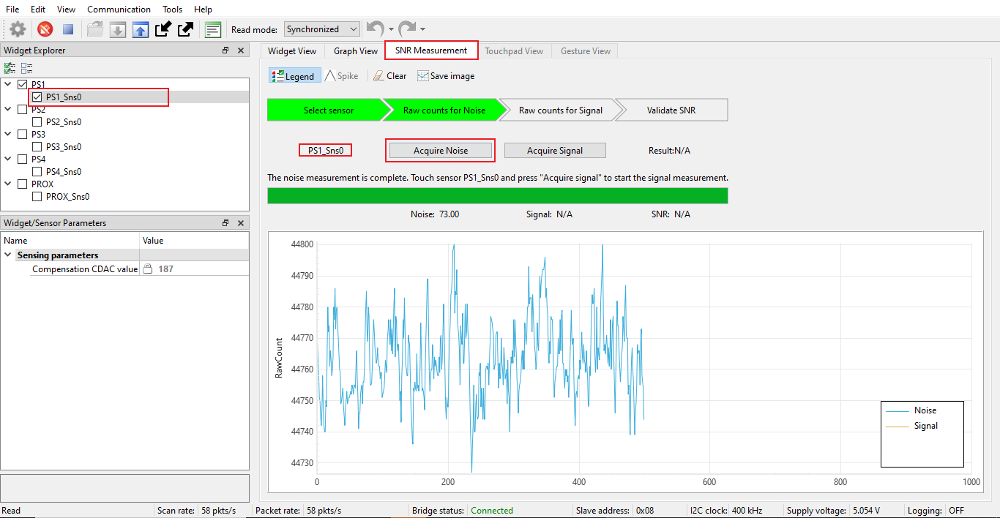
    
10. Once the noise is acquired, place the hand over the [CY8CKIT-024](https://www.infineon.com/CY8CKIT-024) Proximity Shield at a distance of 2 cm and then click **Acquire Signal**. Ensure that the hand remains on the same position as long as the signal acquisition is in progress. 
The calculated SNR on this button is displayed, as shown in **Figure 12**.

    **Figure 12. CAPSENSE&trade; Tuner - SNR measurement**  
   
    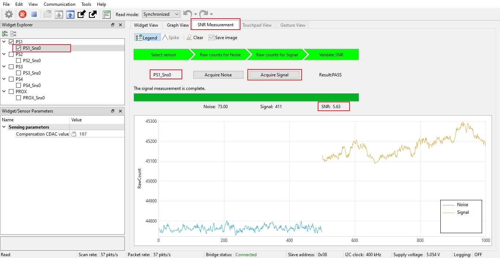

11. If the SNR is above 5:1, switch to the **Graph View** and place the hand over the [CY8CKIT-024](https://www.infineon.com/CY8CKIT-024) Proximity Shield at a distance of 2 cm, and check the **Sensor Signal** value is above 50 as shown in **Figure 13**.

    **Figure 13. CAPSENSE&trade; Tuner - Sensor signal**  
   
    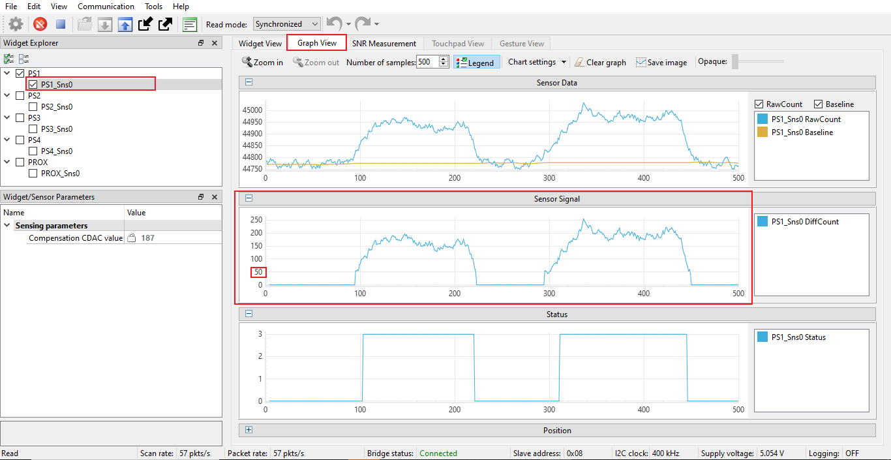


## Tuning procedure
The following steps explain the tuning procedure for the proximity widgets.

> **Note:** See the section "Manual Tuning" in the [AN92239 - Proximity sensing with CAPSENSE&trade;](http://www.cypress.com/documentation/application-notes/an92239-proximity-sensing-capsense) to learn about the considerations for selecting each parameter values.

The tuning flow of the proximity widget is shown in **Figure 14**.

**Figure 14. Proximity widget Tuning flow**

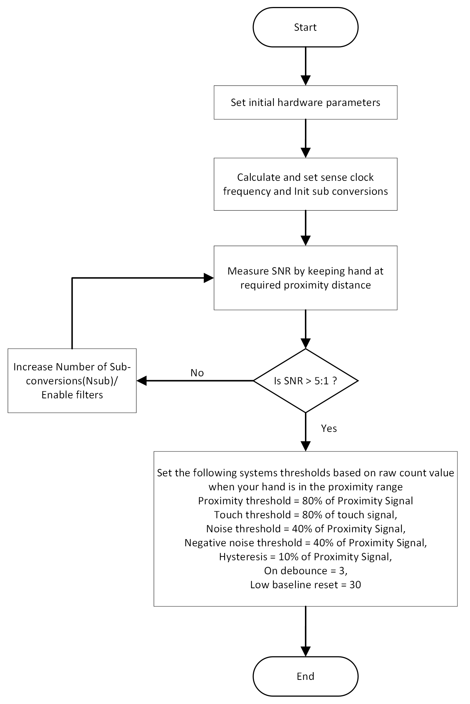

Do the following to tune the proximity widget:

- [Stage 1: Set initial hardware parameters](#stage-1-set-initial-hardware-parameters)

- [Stage 2: Set sense clock frequency](#stage-2-set-sense-clock-frequency)

- [Stage 3: Fine-tune for required SNR and sensor signal](#stage-3-fine-tune-for-required-snr-and-sensor-signal)

- [Stage 4: Tune threshold parameters](#stage-4-tune-threshold-parameters)

### Stage 1: Set initial hardware parameters
-------------------------

1. Connect the board to your PC using the provided USB cable through the KitProg3 USB connector.

2. Launch the Device Configurator tool.

   You can launch the Device Configurator in Eclipse IDE for ModusToolbox&trade; from the **Tools** section in the IDE Quick Panel or in standalone mode from *{ModusToolbox&trade; install directory}/ModusToolbox&trade;/tools_{version}/device-configurator/device-configurator*. In this case, after opening the application, select **File** > **Open** and open the *design.modus* file of the respective application, which is present in the *{Application root directory}/bsps/TARGET_APP_\<BSP-NAME>/COMPONENT_BSP_DESIGN_MODUS* folder.

3. Enable CAPSENSE&trade; channel in Device Configurator as follows:

   **Figure 15. Enable CAPSENSE&trade; in Device Configurator**
   
   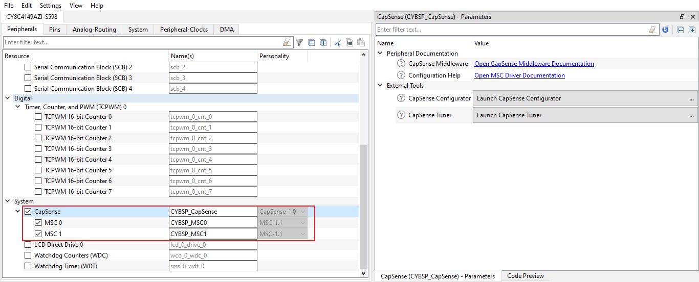

   Save the changes and close the window.

4. Launch the CAPSENSE&trade; Configurator tool.

   You can launch the CAPSENSE&trade; Configurator tool in Eclipse IDE for ModusToolbox&trade; from the "CAPSENSE&trade;" peripheral setting in the Device Configurator or directly from the Tools section in the IDE Quick Panel.

   You can also launch it in standalone mode from *{ModusToolbox&trade; install directory}/ModusToolbox&trade;/tools_{version}/capsense-configurator/capsense-configurator*. In this case, after opening the application, select **File** > **Open** and open the *design.cycapsense* file of the respective application, which is present in the *{Application root directory}/bsps/TARGET_APP_\<BSP-NAME>/COMPONENT_BSP_DESIGN_MODUS* folder.

   See the [ModusToolbox&trade; CAPSENSE&trade; Configurator tool guide](https://www.infineon.com/ModusToolboxCapSenseConfig) for step-by-step instructions on how to configure and launch CAPSENSE&trade; in ModusToolbox&trade;.

5. In the **Basic tab**, four proximity sensors (PS1, PS2, PS3, PS4 and PROX) are configured as a CSD-RM (Self-cap), and set the **CSD tuning mode** as *Manual tuning*.

   **Figure 16. CAPSENSE&trade; Configurator - Basic tab**
   
   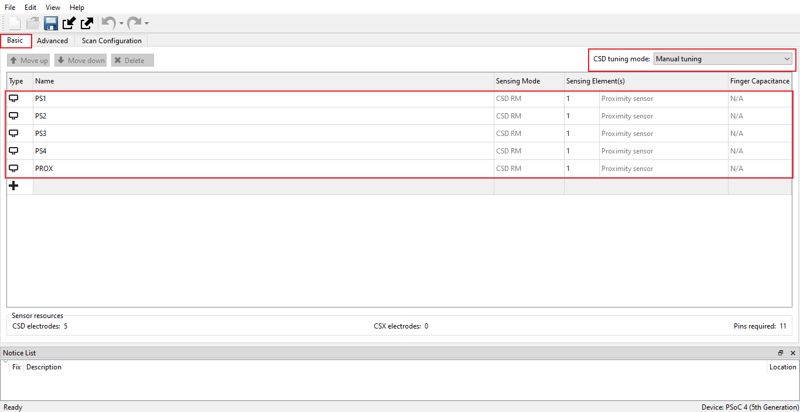
 
6. Do the following in the **General** tab under the **Advanced** tab:
   1. Set the **Modulator clock divider** to **2** to obtain the optimum modulator clock frequency.
 
      > **Note:** For [CY8CKIT-045S](https://www.infineon.com/CY8CKIT-045S), set the **Modulator clock divider** to **2** in the **CSD settings** tab under the **Advanced** tab.

   2. Set the **Number of init sub-conversions** based on the hint shown when you hover over the edit box.
   3. Enable CIC2 hardware filter.
   4. Enable Proximity IIR filter with IIR filter raw coefficient 64.

  **Figure 17. CAPSENSE&trade; Configurator - General settings**

  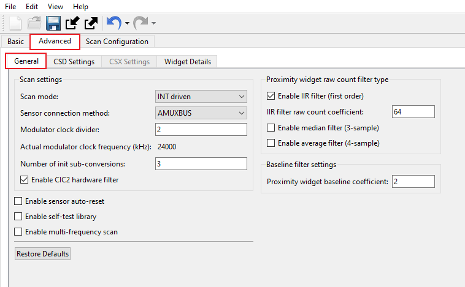

   > **Note:** Each tab has a **Restore Defaults** button to restore the parameters of that tab to their default values.

7. Go to the **CSD settings** tab and make the following changes:

   1. Set **Inactive sensor connection** as **Shield**.

      Connect the inactive sensor, hatch pattern, or any trace that is surrounding the proximity sensor to the driven shield instead of connecting them to ground. This minimizes the signal due to the liquid droplets falling on the sensor. 

   2. Set **Shield mode** as **Active**.

      Setting the shield to active: The driven shield is a signal that replicates the sensor-switching signal. This minimizes the signal due to the liquid droplets falling on the sensor. 

   3. Set **Total shield count** as **2** (Enabling all the inactive sensors as shield during CSD sensor scan).

   4. Select **Enable CDAC auto-calibration** and **Enable compensation CDAC**.

      > **Note:** For [CY8CKIT-045S](https://www.infineon.com/CY8CKIT-045S), select **Enable IDAC auto-calibration** and **Enable compensation IDAC**.

   5. Set **Raw count calibration level (%)** to **70**.

   **Figure 18. CAPSENSE&trade; Configurator - Advanced CSD settings**

   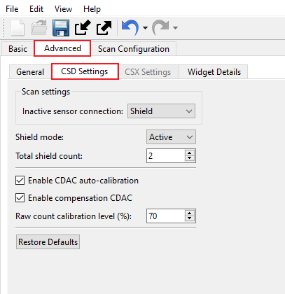
   
8. Go to the **Widget details** tab.

   Select **PS1** from the left pane, and then set the following:

   - **Sense clock divider:** Retain the default value (will be set in [Stage 2:  Set sense clock frequency](#stage-2-set-sense-clock-frequency))

   - **Clock source:** Direct

      > **Note:** Spread spectrum clock (SSC) or PRS clock can be used as a clock source to deal with EMI/EMC issues.

   - **Number of sub-conversions: 60**

     60 is a good starting point to ensure a fast scan time and sufficient signal. This value will be adjusted as required in [Stage 3: Fine-tune for required SNR and sensor signal](#stage-3-fine-tune-for-required-snr-and-sensor-signal).

      > **Note:** For [CY8CKIT-045S](https://www.infineon.com/CY8CKIT-045S), set the **Scan resolution** to default value.
     
    - Retain the default values for widget threshold paremeters.
    
      **Figure 19. CAPSENSE&trade; Configurator - Proximity Widget details tab under the Advanced tab**
      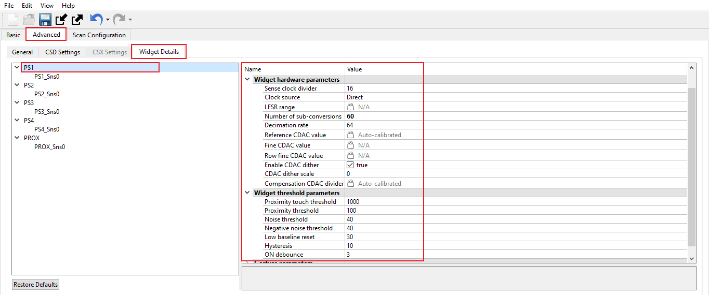
      
    - Repeat the same for PS2,PS3,PS4 and PROX widgets.
9. Go to the **Scan Configuration** tab to select the pins and scan slots. Assign the pins as following:

    **Figure 20. Scan Configuration tab**

    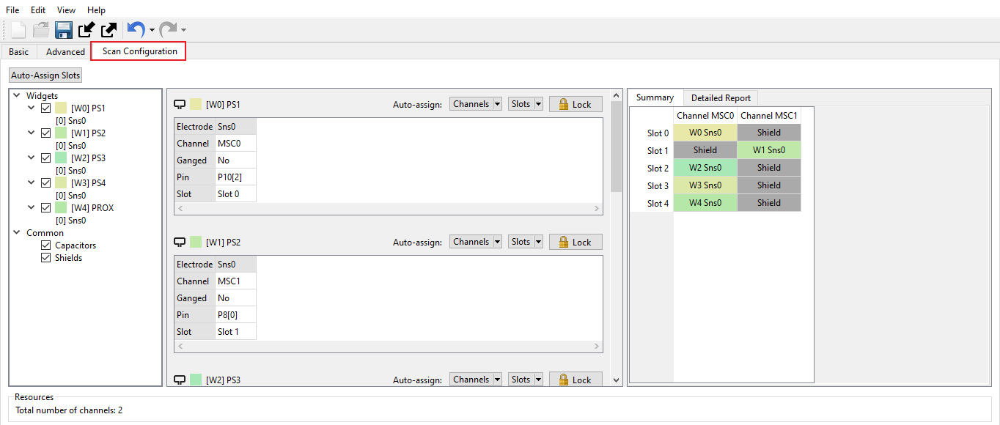

10. Click **Save** to apply the settings.

Refer to the [CAPSENSE&trade; design guide](https://www.infineon.com/AN85951) for detailed information on tuning parameters mentioned here.

### Stage 2: Set sense clock frequency
-------------------------
The sense clock is derived from the Modulator clock using a clock-divider and is used to scan the sensor by driving the CAPSENSE&trade; switched capacitor circuits. Both the clock source and clock divider are configurable.

Select the maximum sense clock frequency such that the sensor and shield capacitance are charged and discharged completely in each cycle. This can be verified using an oscilloscope and an active probe. To view the charging and discharging waveforms of the shield, probe at the shield pin (pin 8.1 for [CY8CKIT-041S-MAX](https://www.infineon.com/CY8CKIT-041S-MAX), and pin 2.5 for [CY8CKIT-045S](https://www.infineon.com/CY8CKIT-045S)). Also observe the waveforms for other shield pins.

**Figure 21** shows proper charging when  the sense clock frequency is correctly tuned, i.e., the voltage is settling to the required voltage at the end of each phase. **Figure 22** shows incomplete settling (charging/discharging) and hence the sense clock divider is set to 20 as shown in **Figure 25**.


   **Figure 21. Proper charge cycle of a sensor**

   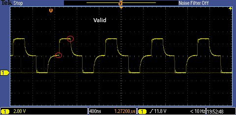

   **Figure 22. Improper charge cycle of a sensor**

   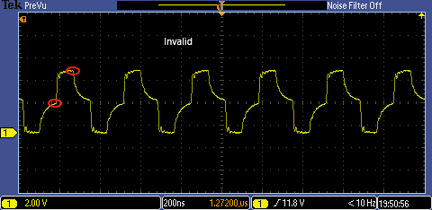

For [CY8CKIT-045S](https://www.infineon.com/CY8CKIT-045S), **Figure 23**  shows proper charging when the sense clock frequency is correctly tuned.

   **Figure 23. Proper charge cycle of a sensor**

   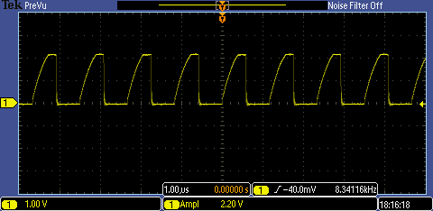

   To set the proper sense clock frequency, follow the steps listed below:

   1. Program the board and launch CAPSENSE&trade; Tuner.

   2. Observe the charging waveform of the sensor and shield as described earlier. 

   3. If the charging is incomplete, increase the Sense clock divider for all the the proximity widgets. Do this in CAPSENSE&trade; Tuner by selecting the sensor and editing the Sense clock divider parameter in the Widget/Sensor Parameters panel.

      - The sense clock divider should be **divisible by 4**. This ensures that all four scan phases have equal durations. 

      - After editing the value, click the **Apply to Device** button and observe the waveform again. Repeat this until complete settling is observed.  

      - Using a passive probe will add an additional parasitic capacitance of around 15 pF; therefore, should be considered during the tuning.

      
   4. Click the **Apply to Project** button so that the configuration is saved to your project. 

      **Figure 24. Sense Clock Divider setting**

      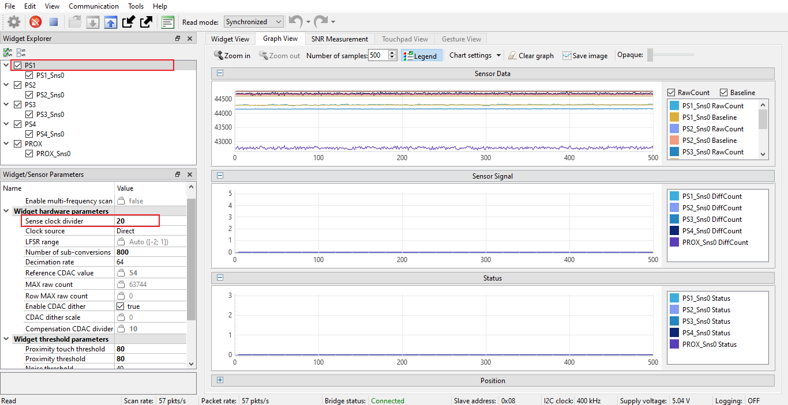

   5. Repeat this process for all the shields. Take the largest sense clock divider so that all the shields charged and discharged completely in each cycle.

      **Table 1. Sense clock parameters obtained for CY8CKIT-024**

      Parameter | CY8CKIT-041S-MAX | CY8CKIT-045S
      :-------- |:-----------|:-------------
      Modulator clock divider | 2 | 2 
      Sense clock divider | 20 | 28 
      
### Stage 3: Fine-tune for required SNR and sensor signal
-------------------------
The sensor should be tuned to have a minimum SNR of 5:1 and a minimum signal of 50 to ensure reliable operation. The sensitivity can be increased by increasing number of sub-conversions, and noise can be decreased by enabling available filters. 

The steps for optimizing these parameters are as follows:

1. Measure the SNR as mentioned in the [Operation](#operation) section.

   Measure the SNR by placing your hand above the proximity loop at maximum proximity height (2 cm in this case).

2. If the SNR is less than 5:1 increase the number of sub-conversions. Edit the number of sub-conversions (N<sub>sub</sub>) directly in the **Widget/Sensor parameters** tab of the CAPSENSE&trade; Tuner.

      > **Note:** Number of sub-conversion should be greater than or equal to 8.

> **Note:** For [CY8CKIT-045S](https://www.infineon.com/CY8CKIT-045S) increase the **Scan Resolution** if the SNR is less than 5:1.

3.  Load the parameters to the device and measure SNR as mentioned in the [Monitor data using CAPSENSE&trade; Tuner](#monitor-data-using-capsense&trade;-tuner) section. 
   
      Repeat steps 1 to 3 until the following conditions are met:

      - Measured SNR from the previous stage is greater than 5:1

      - Signal count is greater than 50

5. If the system is noisy (>40% of signal), enable filters.

   Whenever the CIC2 filter is enabled, it is recommended to enable the IIR filter for optimal noise reduction. Therefore, this example has the IIR filter enabled as well.

   > **Note** : Increasing number of sub-conversions and enabling filters increases the scan time which in turn decreases the responsiveness of the sensor. Increase in scan time also increases the power consumption. Therefore, the number of sub-conversions and filter configuration must be optimized to achieve a balance between SNR, power, and refresh rate. 

### Stage 4: Tune threshold parameters
-------------------------
Various thresholds, relative to the signal, need to be set for each sensor. Do the following in CAPSENSE&trade; Tuner to set up the thresholds for a widget:

1. Switch to the **Graph View** tab and select **PS1**.

2. Place your hand at 2 cm directly above the proximity sensor and monitor the touch signal in the **Sensor signal** graph, as shown in **Figure 25**. 

   **Figure 25. Sensor signal when hand is in the proximity of the sensor**
   
   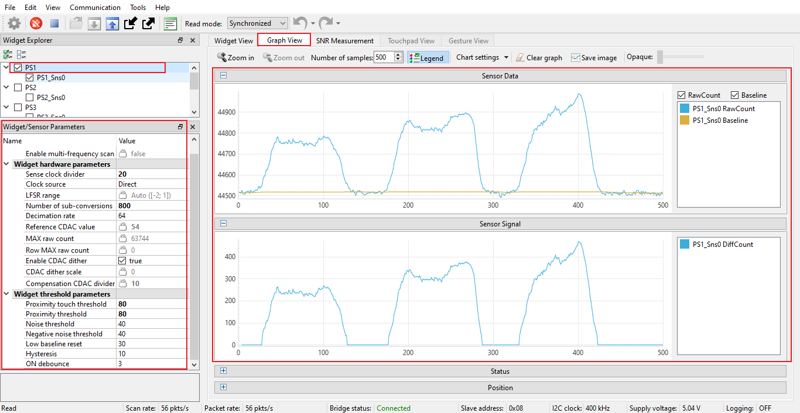

3. Note the signal measured and set the thresholds according to the following recommendations:

   - Proximity threshold = 80% of the signal

   - Proximity touch threshold = 80% of the signal

     Here, the touch threshold denotes the threshold for the proximity sensor to detect a touch when it is touched by a finger. When the proximity sensor is touched, the sensor yields a higher signal compared the proximity signal; therefore, it is the **touch signal**. To measure the touch signal count, touch the sensor and monitor the signal in the **Sensor signal** graph.

   - Noise threshold = 40% of the signal

   - Negative noise threshold = 40% of the signal

   - Hysteresis = 10% of signal

   - Low baseline reset = 30

   - Hysteresis = 10% of the signal

   - ON debounce = 3

4. Apply the settings to the device by clicking **To device**.

   **Figure 26. Apply settings to device**
   
   

   If your sensor is tuned correctly, you will observe that the proximity status goes from 0 to 3 in the **Status** sub-window of the **Graph View** window as **Figure 27** shows. The successful tuning of the proximity sensor is also indicated by LEDs (LED1-LED5) in the kit; it turns ON when the hand comes closer than the maximum distance and turns OFF when the hand is moved away from the proximity sensor.

   **Figure 27. Sensor status in CAPSENSE&trade; Tuner showing proximity status**
   
   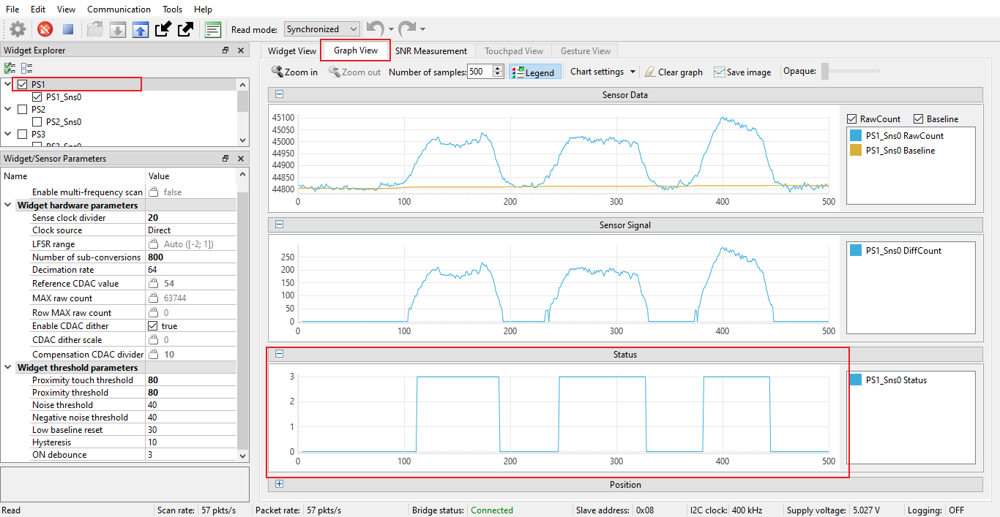
   
   **Table 2. Tuning parameters obtained based on sensors for [CY8CKIT-024](https://www.infineon.com/CY8CKIT-024)**

   Parameter | PS1 |
   :-------- |:-----------|
   Proximity touch threshold | 80 |
   Proximity threshold | 80 |
   Noise threshold | 40 |
   Negative noise threshold | 40 |
   Low baseline reset | 30 |
   Hysteresis |10 |
   ON debounce | 3|

> **Note:** Follow the same process for PS2, PS3 and PS4 proximity widgets.

## Debugging
You can debug the example to step through the code.

<details><summary><b>In Eclipse IDE</b></summary>

Use the **\<Application Name> Debug (KitProg3_MiniProg4)** configuration in the **Quick Panel**. For details, see the "Program and debug" section in the [Eclipse IDE for ModusToolbox&trade; user guide](https://www.infineon.com/MTBEclipseIDEUserGuide).

</details>

<details><summary><b>In other IDEs</b></summary>

Follow the instructions in your preferred IDE.

</details>

## Design and implementation

The project uses the [CAPSENSE&trade; middleware](https://github.com/Infineon/capsense) (see ModusToolbox&trade; software user guide for more details on selecting the middleware). See [AN85951 – PSoC&trade; 4 and PSoC&trade; 6 MCU CAPSENSE&trade; design guide](https://www.infineon.com/AN85951) for more details on CAPSENSE&trade; features and usage.

The design has four proximity sensors and the EZI2C peripheral. The EZI2C slave peripheral is used to monitor the sensor data of proximity sensors on a PC using the CAPSENSE&trade; tuner available in the Eclipse IDE for ModusToolbox&trade; via I2C communication.  

The code example uses only the PS1, PS2, PS3, and PS4 proximity sensors, as shown in **Figure 16**. The PROX sensor is not scanned in the firmware and is always connected to the driven shield along with the GND/SHIELD loop. The proximity sensors PS1, PS2, PS3, and PS4 on [CY8CKIT-024](https://www.infineon.com/CY8CKIT-024) are used to detect swipe gestures in the X-axis and Y-axis. PS1 and PS2 are used for detecting swipe gestures in the X-axis, while PS3 and PS4 are used for detecting swipe gestures in the Y-axis.

The projects contain two macros, **GESTURE_AXIS** and **LED_DRIVE_SEQUENCE**, in the user_gestures.h file. These macros are used to select the type of gesture to be detected and the LED drive sequence respectively.
**GESTURE_AXIS:** This macro determines the type of gesture detected by the device. Set this macro to “XAXIS” to detect swipe gestures in the X-axis, and set it to “YAXIS” to detect swipe gestures in the Y-axis. By default, the macro is set to “XAXIS” to detect swipe gestures in the X-axis.
**LED_DRIVE_SEQUENCE:** This macro determines how the LEDs are driven when a gesture is detected. Set this macro to “LED_DRIVE_DURING_GESTURE” to drive the LEDs based on the current position of the hand, and set it to “LED_DRIVE_AFTER_GESTURE” to drive the LEDs after a gesture is detected. By default, the macro is set to “LED_DRIVE_DURING_GESTURE.”

When the macro is set to **“LED_DRIVE_DURING_GESTURE,”** in user_gestures.h file the LEDs (LED1–LED5) are driven as listed in **Figure 3**. When the macro is set to **“LED_DRIVE_AFTER_GESTURE,”** in user_gestures.h file the LEDs (LED1–LED5) are driven as listed in **Figure 5**.

### Resources and settings

**Figure 28. Device configurator - EZI2C Pepipheral** 
 
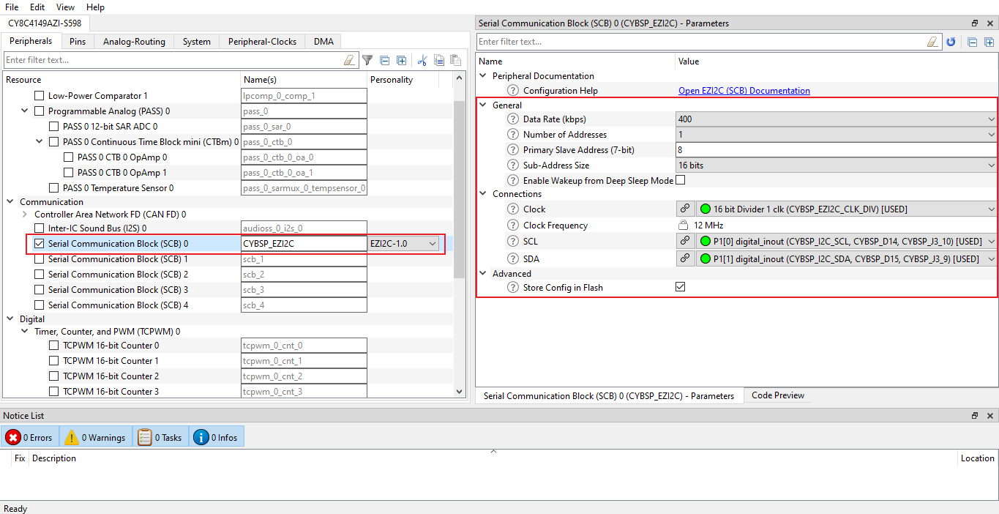
 
**Table 3. Application resources**

| Resource  |  Alias/object     |    Purpose     |
| :------- | :------------    | :------------ |
| SCB (I2C) (PDL) | CYBSP_EZI2C | EZI2C slave driver to communicate with the CAPSENSE&trade; tuner |
| CAPSENSE&trade; | CYBSP_CapSense | CAPSENSE&trade; driver to interact with the hardware and interface CAPSENSE&trade; sensors |

### Firmware flow

**Figure 29. Firmware flowchart**

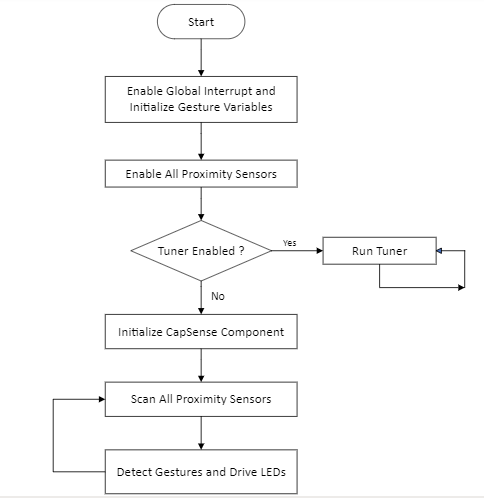

<br>

## Related resources

Resources  | Links
-----------|----------------------------------
Application notes  | [AN79953](https://www.infineon.com/AN79953) – Getting started with PSoC&trade; 4
Code examples  | [Using ModusToolbox&trade; software](https://github.com/Infineon/Code-Examples-for-ModusToolbox-Software) on GitHub <br> [Using PSoC&trade; Creator](https://www.infineon.com/cms/en/design-support/software/code-examples/psoc-3-4-5-code-examples-for-psoc-creator/)
Device documentation | [PSoC&trade; 4 datasheets](https://www.infineon.com/cms/en/search.html#!view=downloads&term=psoc4&doc_group=Data%20Sheet) <br>[PSoC&trade; 4 technical reference manuals](https://www.infineon.com/cms/en/search.html#!view=downloads&term=psoc4&doc_group=Additional%20Technical%20Information)
Development kits | Select your kits from the [Evaluation Board Finder](https://www.infineon.com/cms/en/design-support/finder-selection-tools/product-finder/evaluation-board) page.
Libraries on GitHub | [mtb-pdl-cat2](https://github.com/Infineon/mtb-pdl-cat2) – PSoC&trade; 4 peripheral driver library (PDL)<br> [mtb-hal-cat2](https://github.com/Infineon/mtb-hal-cat2) – Hardware abstraction layer (HAL) library
Middleware on GitHub | [capsense](https://github.com/Infineon/capsense) – CAPSENSE&trade; library and documents <br>
Tools  | [ModusToolbox&trade; software](https://www.infineon.com/modustoolbox) – ModusToolbox&trade; software is a collection of easy-to-use software and tools enabling rapid development with Infineon MCUs, covering applications from embedded sense and control to wireless and cloud-connected systems using AIROC&trade; Wi-Fi and Bluetooth® connectivity devices. <br /> [PSoC&trade; Creator](https://www.infineon.com/cms/en/design-support/tools/sdk/psoc-software/psoc-creator/) – IDE for PSoC&trade; and FM0+ MCU development

<br />


## Other resources

Infineon provides a wealth of data at www.infineon.com to help you select the right device, and quickly and effectively integrate it into your design.

## Document history

Document title: *CE237892* - *PSoC&trade; 4: CAPSENSE™ proximity gestures*

 Version | Description of change
 ------- | ---------------------
 1.0.0   | New code example
 1.1.0   | Added support for CY8CKIT-045S


<br />

---------------------------------------------------------

© Cypress Semiconductor Corporation, 2023. This document is the property of Cypress Semiconductor Corporation, an Infineon Technologies company, and its affiliates ("Cypress").  This document, including any software or firmware included or referenced in this document ("Software"), is owned by Cypress under the intellectual property laws and treaties of the United States and other countries worldwide.  Cypress reserves all rights under such laws and treaties and does not, except as specifically stated in this paragraph, grant any license under its patents, copyrights, trademarks, or other intellectual property rights.  If the Software is not accompanied by a license agreement and you do not otherwise have a written agreement with Cypress governing the use of the Software, then Cypress hereby grants you a personal, non-exclusive, nontransferable license (without the right to sublicense) (1) under its copyright rights in the Software (a) for Software provided in source code form, to modify and reproduce the Software solely for use with Cypress hardware products, only internally within your organization, and (b) to distribute the Software in binary code form externally to end users (either directly or indirectly through resellers and distributors), solely for use on Cypress hardware product units, and (2) under those claims of Cypress’s patents that are infringed by the Software (as provided by Cypress, unmodified) to make, use, distribute, and import the Software solely for use with Cypress hardware products.  Any other use, reproduction, modification, translation, or compilation of the Software is prohibited.
<br />
TO THE EXTENT PERMITTED BY APPLICABLE LAW, CYPRESS MAKES NO WARRANTY OF ANY KIND, EXPRESS OR IMPLIED, WITH REGARD TO THIS DOCUMENT OR ANY SOFTWARE OR ACCOMPANYING HARDWARE, INCLUDING, BUT NOT LIMITED TO, THE IMPLIED WARRANTIES OF MERCHANTABILITY AND FITNESS FOR A PARTICULAR PURPOSE.  No computing device can be absolutely secure.  Therefore, despite security measures implemented in Cypress hardware or software products, Cypress shall have no liability arising out of any security breach, such as unauthorized access to or use of a Cypress product. CYPRESS DOES NOT REPRESENT, WARRANT, OR GUARANTEE THAT CYPRESS PRODUCTS, OR SYSTEMS CREATED USING CYPRESS PRODUCTS, WILL BE FREE FROM CORRUPTION, ATTACK, VIRUSES, INTERFERENCE, HACKING, DATA LOSS OR THEFT, OR OTHER SECURITY INTRUSION (collectively, "Security Breach").  Cypress disclaims any liability relating to any Security Breach, and you shall and hereby do release Cypress from any claim, damage, or other liability arising from any Security Breach.  In addition, the products described in these materials may contain design defects or errors known as errata which may cause the product to deviate from published specifications. To the extent permitted by applicable law, Cypress reserves the right to make changes to this document without further notice. Cypress does not assume any liability arising out of the application or use of any product or circuit described in this document. Any information provided in this document, including any sample design information or programming code, is provided only for reference purposes.  It is the responsibility of the user of this document to properly design, program, and test the functionality and safety of any application made of this information and any resulting product.  "High-Risk Device" means any device or system whose failure could cause personal injury, death, or property damage.  Examples of High-Risk Devices are weapons, nuclear installations, surgical implants, and other medical devices.  "Critical Component" means any component of a High-Risk Device whose failure to perform can be reasonably expected to cause, directly or indirectly, the failure of the High-Risk Device, or to affect its safety or effectiveness.  Cypress is not liable, in whole or in part, and you shall and hereby do release Cypress from any claim, damage, or other liability arising from any use of a Cypress product as a Critical Component in a High-Risk Device. You shall indemnify and hold Cypress, including its affiliates, and its directors, officers, employees, agents, distributors, and assigns harmless from and against all claims, costs, damages, and expenses, arising out of any claim, including claims for product liability, personal injury or death, or property damage arising from any use of a Cypress product as a Critical Component in a High-Risk Device. Cypress products are not intended or authorized for use as a Critical Component in any High-Risk Device except to the limited extent that (i) Cypress’s published data sheet for the product explicitly states Cypress has qualified the product for use in a specific High-Risk Device, or (ii) Cypress has given you advance written authorization to use the product as a Critical Component in the specific High-Risk Device and you have signed a separate indemnification agreement.
<br />
Cypress, the Cypress logo, and combinations thereof, WICED, ModusToolbox, PSoC, CapSense, EZ-USB, F-RAM, and Traveo are trademarks or registered trademarks of Cypress or a subsidiary of Cypress in the United States or in other countries. For a more complete list of Cypress trademarks, visit www.infineon.com. Other names and brands may be claimed as property of their respective owners.


